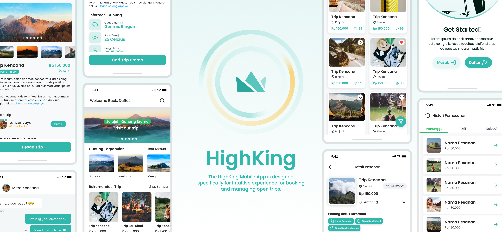

<h1> HighKing - Your Ultimate Hiking Companion </h1>

<!-- You can make badge by read on official documentation at https://shields.io/badges -->

<a href="#-introduction">Introduction</a> &nbsp;&bull;&nbsp;
<a href="#-tech-stack">Tech Stack</a> &nbsp;&bull;&nbsp;
<a href="#-reference">Reference</a>&nbsp;&bull;&nbsp;
<a href="#-issue">Issue</a>

## 📄 Introduction

The HighKing app aims to revolutionize the mountain climbing experience in Indonesia by providing a comprehensive, user-friendly mobile platform for climbers. Our app addresses key challenges faced by the climbing community, such as accessing accurate mountain information, finding reliable climbing partners, booking mountaineering trips, and ensuring climber safety.

Key features include detailed mountain information, secure guide and partner booking, open trip listings, and a community space for sharing experiences and tips. Climbers can access comprehensive data about mountains, book trusted guides, and join open trips organized by verified partners, ensuring a safe and enjoyable climbing experience.

## 💻 Tech Stack

> Framework, Library, Database, Tools, etc

## 📚 Reference

- [Clean Architecture](https://developer.android.com/topic/architecture)
- [Retrofit](https://square.github.io/retrofit/)
- [ViewPager](https://developer.android.com/training/animation/screen-slide)
- [DataStore](https://developer.android.com/topic/libraries/architecture/datastore)
- [Room](https://developer.android.com/training/data-storage/room/)
  
## 🚩 Issue

If you found a bug or an issue, please report by opening a new issue on [this repository](https://github.com/ENTS-H104/highking-mobile-app/issues).